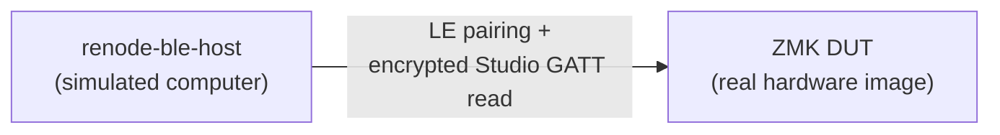
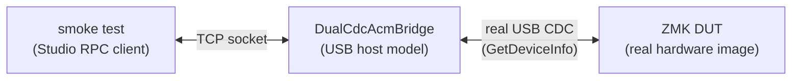
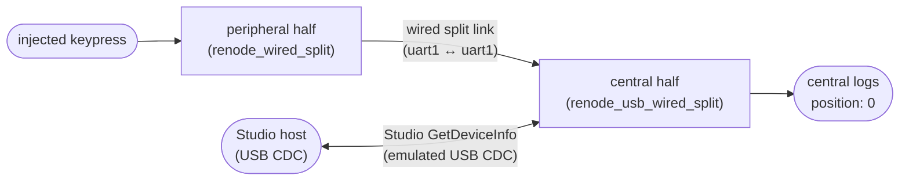

# Renode testing in depth

This page covers `west zmk-renode-test` beyond the [README](../README.md)
quickstart: the advanced flags, the `ZMK_RENODE_*` module-test env contract,
observing a real image over SEGGER RTT, ble-mode performance, troubleshooting,
and limitations. For how a real hardware image boots under emulation at all
(platform stubs, fake CCM, on-air constraints) see
[renode-internals.md](design/renode-internals.md).

`west zmk-renode-test` has **four modes** (`--mode`, default `ble` — it boots
the exact hardware-flashable image with no extra module config); `--elf` is the
DUT (the central half in `split` / `ble-split`). The generic smoke (boot + Studio) is what
`.github/actions/zmk-renode-test/action.yml` always runs before any
module-specific test. A module's own `tests/renode/*_test.py` run afterwards and
`import renode_harness` directly for anything more specific.

## The three standardized checks

Every mode's smoke runs the **same three checks**, in order, so a green run means
the same thing regardless of transport:

| # | Check | What it does |
|---|-------|--------------|
| **1** | connection | the mode's transport/link is up (USB enumerated, or the encrypted BLE link — and the encrypted split link for a split). |
| **2** | key input | a keypress at position 0, injected on the DUT (on the **peripheral** for a split), is processed by the DUT/central — observed as its `position: 0` keymap log (`keymap.c` `LOG_DBG`). The non-split `usb`/`ble` DUT and the split central read this off **SEGGER RTT** (their console is USB-CDC, silent under Renode); the wired-split central reads it off its uart0 console. |
| **3** | Studio RPC | a real framed Studio `GetDeviceInfo` round trip returns a well-formed response with a non-empty device name. Over USB CDC in `usb`/`wired-split`; over the encrypted BLE RPC characteristic in `ble`/`ble-split` (the `renode-ble-host` app writes the framed request and reassembles the indicated response — its `STAGE:S6` markers — which the harness parses). |

The per-mode sections below detail how each mode wires its transports into these
three (and the extra guarantees a mode adds, e.g. the ble-split full chain or the
USB device→host burst regression guard). The smoke prints `CHECK 1/3` … `CHECK
3/3` lines as it goes.

## Command reference

```
usage: west zmk-renode-test [-h] --elf ELF [--mode {usb,ble,wired-split,ble-split}]
                            [--peripheral-elf PERIPHERAL_ELF] [--host-elf HOST_ELF]
                            [--boot-timeout BOOT_TIMEOUT] [--skip-smoke]
                            [--rtt] [--min-virtual MIN_VIRTUAL]
                            [--virtual-budget VIRTUAL_BUDGET] [--steady-quantum Q]
                            [--storage-addr ADDR] [--storage-size SIZE]
                            [--renode-version VER]
                            [tests_dir]
```

Common:

| Flag | Applies to | Meaning |
|---|---|---|
| `--elf` (required) | all | the DUT firmware ELF (built by the caller); the split **central** half in `wired-split` / `ble-split`. |
| `--mode {usb,ble,wired-split,ble-split}` | — | `ble` (default), `usb` (real image, Studio over the emulated USB CDC), `wired-split` (wired split whose central answers Studio over USB), or `ble-split` (wireless split). |
| `--peripheral-elf` | wired-split, ble-split | the split **peripheral** half's firmware ELF (`--elf` is the central). Required for `--mode wired-split` / `ble-split`. |
| `--host-elf` | ble, ble-split | the `renode-ble-host` app ELF. ble: given → full S4/S5 smoke, omitted → boot-liveness. **Required** for `ble-split`. |
| `--boot-timeout` | wired-split, usb | seconds to wait for the boot banner (default 20). |
| `--skip-smoke` | all | skip the smoke test; run only `tests_dir`. |

Advanced (rarely needed):

| Flag | Applies to | Meaning |
|---|---|---|
| `--rtt` | ble (liveness) | capture Zephyr SEGGER RTT log output during the run and fail on RTT fatal lines. See [Observing a real image over SEGGER RTT](#observing-a-real-image-over-segger-rtt). |
| `--min-virtual` | ble (liveness) | virtual seconds to run before PC sampling (default 20). |
| `--virtual-budget` | ble / ble-split (with host) | virtual seconds to reach the encrypted read before failing (ble default 20, ~3.3 s typical; ble-split floors this to ≥120 s **per attempt**, ~18 s typical, and retries the whole emulation once). |
| `--steady-quantum` | ble (with host) | after S4, raise the global time-sync quantum (e.g. `0.001`) for the steady-state phase. See [ble-mode performance](#ble-mode-performance). |
| `--storage-addr` / `--storage-size` | ble, usb | NVS `storage_partition` address/size preloaded as erased `0xFF` (default `0xec000`/`0x8000`, xiao_ble). |
| `--renode-version` | both | Renode portable release to install/use (default `1.16.1`; must match the checked-in `.repl`). |

## ble mode: what it proves



ble mode boots **two real ARM images** on one emulated Renode BLE medium — the
unmodified ZMK DUT (advertiser) and the [`renode-ble-host`](../renode-ble-host/)
app (the simulated computer) — and asserts the host reaches
`STAGE:S4-SECURITY-CHANGED OK` (encrypted link up) and `STAGE:S5-GATT-READ OK`
(encrypted read of the ZMK Studio RPC characteristic). **What it proves:** LE SC
Just Works pairing and an encrypted GATT read run end-to-end on the real
firmware — the same code paths as a hardware Studio-over-BLE session — with
**zero firmware-side deviation** on the DUT. It is a **functional** check, not a
cryptographic one (see the fake-CCM disclaimer in
[renode-internals.md](design/renode-internals.md#fake-ccm--not-cryptographically-real)).

The smoke waits for the encrypted link (S4) and the framed `GetDeviceInfo` round
trip (the host's `STAGE:S6`) — the [three standardized checks](#the-three-standardized-checks)
are then CHECK 1 (S4 connection), CHECK 2 (inject a keypress on the DUT, confirm
`position: 0` on its RTT) and CHECK 3 (parse the S6 response). `--virtual-budget`
(default 20 virtual seconds) caps how long it waits, and a wall-clock safety net
stops a wedged run. A run reaches the encrypted read at ~3.3 s virtual and
~**35–50 s wall** (≈0.10× realtime on a lightly-loaded host). (The host still does
its S5 raw GATT read first — it chains straight into the S6 framed round trip.)

**Without `--host-elf`**, ble mode degrades to a **boot-liveness check**: it
boots just the real DUT image (no host, no BLE peer) and proves it is still
running — not parked in a Zephyr fatal — after `--min-virtual` virtual seconds
(default 20). It runs the emulation to that threshold, then samples the CPU `PC`
a few times and resolves each symbol. It **fails** if any sample lands in a
fatal frame (`arch_system_halt` / `z_fatal_error` / `k_sys_fatal_error_handler`
— a Zephyr fatal parks the CPU spinning in `arch_system_halt`) and **passes**
otherwise; if the image happens to have a console (observation builds), its
output is captured and also checked for `FATAL ERROR` / `Halting system`, but
console output is not required.

## usb mode: what it proves (and when to pick it)



usb mode boots the **same real flashable image ble mode runs** — no extra build
— on the `xiao_nrf52840_usb.repl` platform, where the python USBD stub is
replaced by the forked `NRF_USBD_Full` C# model. The `DualCdcAcmBridge` USB
host external then performs **real register-level enumeration** of the image's
USB composite (SETUP/EP0, SET_CONFIGURATION, descriptor parsing, DTR) and
exposes its CDC-ACM function(s) as TCP sockets, over which the smoke asserts a
core Studio `GetDeviceInfo` round trip — the image's **real USB Studio
transport**, bidirectionally. See
[renode-internals.md](design/renode-internals.md#usb-mode-the-nrf_usbd_full-fork--the-dualcdcacmbridge)
for the model internals.

The smoke adapts to the composite it finds (auto-detected from the real
descriptors via the bridge — no flag):

- a standard `studio-rpc-usb-uart` image = **one** CDC (Studio) + HID → Studio
  RPC asserted on it;
- an image that also enables `CONFIG_ZMK_USB_LOGGING` = **two** CDCs, board
  console first, Studio second → the Zephyr boot banner (`*** Booting Zephyr
  …`) is *also* asserted on the console CDC. (The `Welcome to ZMK` line is a
  *log* message that may be routed to another backend, so it is not asserted.)

As a safety net the smoke retries the **whole emulation once** (the ble-split
pattern): a usb run is fast and deterministic on an idle host, but the
wall-clock-paced attach can lose races when another heavyweight emulation is
sharing the machine.

**Choosing between usb / ble** for a module's Studio-RPC test:

| Pick | When | Why |
|---|---|---|
| **usb** | module RPC tests against the real artifact (the common case) | real flashable image **and** a fast bidirectional Studio round trip — single machine, no BLE pairing or 10 µs quantum cost (~45 s vs ble's ~35–90 s, with far more of it doing useful RPC work) |
| **ble** | you specifically need the BLE transport path (pairing, encrypted GATT read) | it is the only mode exercising the BLE Studio transport |

```bash
$ west zmk-renode-test tests/renode --mode usb --elf build/<artifact>/zephyr/zmk.elf
```

## wired-split mode: what it proves



wired-split mode boots a **wired split pair** — a central (`--elf`) and a
peripheral (`--peripheral-elf`) — as two Renode machines whose split-link UARTs
(`uart1`) are cross-connected through a Renode UART hub
(`platforms/usb_wired_split.resc`, via `renode_harness.boot_usb_wired_split`).
The two boards talk over ZMK's `zmk,wired-split` transport
(`CONFIG_ZMK_SPLIT_WIRED`); each half's console is on its own `uart0` socket. The
central additionally enumerates its USB composite (NRF_USBD_Full +
DualCdcAcmBridge) so Studio RPC rides the emulated **USB CDC**.

**What it proves — both halves at once:**

1. **Studio over USB** — a Studio `GetDeviceInfo` round trip completes over the
   central's USB CDC, exactly as in `usb` mode but on the split central.
2. **Wired relay** — a synthetic keypress injected on the peripheral (`gpio0`
   pin 2, the first `kscan-gpio-direct` input) is relayed over the split UART and
   processed by the central, which logs the relayed key `position: 0` (ZMK's
   default DBG log level).

The smoke waits for both banners, then settles ~3 s before injecting (there is
**no** cross-machine execution-order guarantee at `t=0`, so an event fired too
early races the central's UART RX-enable and is silently dropped — the historical
wired-split boot-order gotcha).

**Why USB for Studio:** the nRF52840 has only two UARTEs, both consumed here
(`uart0` console + `uart1` split link), so there is no third UART for a Studio
transport — but the wired split frees the **USB** peripheral, which the central
uses for Studio instead. This is the one combination the older fixed presets
could not express; it is now the `wired-split` preset (`--host-link usb
--split-link wired`).

The central builds from this repo's `renode_usb_wired_split` shield (console on
`uart0`, wired split on `uart1`, USB Studio on; `studio-rpc-usb-uart` snippet);
the peripheral is the plain `renode_wired_split` half — see
[`tests/zmk-config/build-usb-split.yaml`](../tests/zmk-config/build-usb-split.yaml):

```bash
$ west zmk-build tests/zmk-config --build-yaml tests/zmk-config/build-usb-split.yaml -af usb-wired -d build
$ west zmk-renode-test --mode wired-split \
      --elf build/usb-wired-central/zephyr/zmk.elf \
      --peripheral-elf build/usb-wired-peripheral/zephyr/zmk.elf
```

> **Studio-less wired split.** For a plain wired pair with no Studio at all
> (both UARTEs on console + split link), use the axis flags `--host-link none
> --split-link wired` with
> [`build-split.yaml`](../tests/zmk-config/build-split.yaml) (the
> `renode_wired_split` shield for both halves). That path asserts only the wired
> relay, not a Studio round trip.

## ble-split mode: what it proves

ble-split mode boots **three real ARM images** on one emulated Renode BLE medium
and proves a whole **wireless split** works end to end:


The split **central** half (`--elf`) is BOTH a GAP central — it scans, connects
and pairs to the split **peripheral** half (`--peripheral-elf`) — **and** a GAP
peripheral: it advertises ZMK Studio and the `--host-elf` app connects and pairs
to *it*, then does the encrypted Studio GATT read. The smoke asserts, **in
order**:

1. **the split link secures** — the peripheral half's SEGGER-RTT log shows
   `Security changed: … level 2` (BT security L2 between peripheral and central).
   The peripheral half is built with RTT + `CONFIG_ZMK_LOG_LEVEL_DBG` precisely
   so this is observable (its USB-CDC console is silent under Renode); the
   harness captures that RTT stream.
2. **then the host reads Studio through the central** — the host reaches
   `STAGE:S4-SECURITY-CHANGED OK` and `STAGE:S5-GATT-READ OK` against the central.

Reaching S5 **through the split central** proves the whole
peripheral → central → host encrypted chain: the same central that holds the
encrypted split link is serving the host's encrypted Studio read. The smoke also
asserts **0** radio `trimming` warnings — every on-air PDU on **both** links
stayed within Renode's 31-byte cap (see the DLE-27 note in
[renode-internals.md](design/renode-internals.md#the-two-on-air-constraints-both-load-bearing)).
Both the split link and the Studio link are encrypted, so **all three** machines
carry the fake CCM.

Under the 3-machine load the split and host pairings race: both do an LE Secure
Connections pairing, and on Renode's shared BLE medium two pairings running
close together can cross their SMP DHKey-Check PDUs (`Unexpected SMP code 0x0d`
→ `in-progress pairing has been deleted` → `err 9`). Whichever link pairs first
wins; the loser can fail to recover within one emulation's budget. This is a
transient property of the emulated radio, **not** a firmware regression — both
links pair fine in isolation. Within an attempt, a lost SMP packet that ZMK (or
the host) recovers from by disconnect/rescan/retry is **tolerated** (transient
`Security failed` / host-fail markers only count for the report); the attempt
only fails on the time budget. On top of that, `run_ble_split_smoke` retries the
**whole emulation once** (a fresh boot re-rolls the race), so a genuine break —
which fails *both* attempts — is still caught. A winning attempt settles by
~18 s virtual (default per-attempt budget 120 s); at ~0.1× realtime that is
~**3 min wall** on a lightly-loaded host, and a full retry roughly doubles the
worst case (the CI job budgets 60 min). See
[ble-mode performance](#ble-mode-performance) for the quantum cost; three CPUs
at the load-bearing 10 µs quantum is the heaviest configuration here.

Building the two halves + host — the split shield caps
`CONFIG_BT_CTLR_DATA_LENGTH_MAX=27` on **both** halves (see
`tests/zmk-config/boards/shields/renode_split/`):

```bash
$ west zmk-build tests/zmk-config --build-yaml tests/zmk-config/build-ble-split.yaml -af ble-split-central -d build
$ west zmk-build tests/zmk-config --build-yaml tests/zmk-config/build-ble-split.yaml -af ble-split-peripheral -d build
$ west build -b nrf52840dk/nrf52840 -d build/ble-host -s renode-ble-host -- -DCONFIG_RENODE_BLE_HOST_TARGET_NAME='"Renode"'
$ west zmk-renode-test --mode ble-split \
      --elf build/ble-split-central/zephyr/zmk.elf \
      --peripheral-elf build/ble-split-peripheral/zephyr/zmk.elf \
      --host-elf build/ble-host/zephyr/zephyr.elf
```

## Module-test env contract

After the smoke test, every `*_test.py` directly under `tests_dir` runs as
`python3 <file> -v` with the harness on `PYTHONPATH` and this environment set:

| Variable | When | Meaning |
|---|---|---|
| `ZMK_RENODE_MODE` | always | `usb`, `ble`, `split`, or `ble-split` — which harness the test should build. |
| `ZMK_RENODE_ELF` | always | absolute path to the DUT ELF (the split **central** half in `split` / `ble-split`). |
| `ZMK_RENODE_PERIPHERAL_ELF` | split, ble-split | absolute path to the split **peripheral** half's ELF, for `boot_split_wired` / `boot_ble_split`. |
| `ZMK_RENODE_STORAGE_ADDR` / `ZMK_RENODE_STORAGE_SIZE` | ble, ble-split, usb | NVS `storage_partition` overrides (hex), for `boot_single_real` / `boot_ble_pair` / `boot_ble_split`. |
| `ZMK_RENODE_HOST_ELF` | ble (with `--host-elf`), ble-split | absolute path to the `renode-ble-host` app ELF, for `boot_ble_pair` / `boot_ble_split`. |

A `ble`-mode test builds a real machine via
`renode_harness.boot_single_real(...)` (liveness) or a two-machine pair via
`renode_harness.boot_ble_pair(dut_elf, host_elf)`. A `usb`-mode test builds the
real machine on the usb platform and attaches the USB host bridge:

```python
session, console, _ = renode_harness.boot_single_real(
    renode_path, elf, repl_template="xiao_nrf52840_usb.repl", port_base=pb
)
time.sleep(8)  # let the guest's USB init settle (enable + pullup)
cdc0, cdc1 = renode_harness.attach_dual_cdc_bridge(session, pb + 4, pb + 5)
# cdc0/cdc1 in descriptor interface order; poll `sysbus.bridge_cdcN IsWired`
# over session.mon to see which channels the composite actually wired.
```

A `split`-mode test builds a
wired pair via `renode_harness.boot_split_wired(central_elf, peripheral_elf)`. A
`ble-split`-mode test builds the three-machine split via
`renode_harness.boot_ble_split(central_elf, peripheral_elf, host_elf)`.

## Observing a real image over SEGGER RTT

PC-symbol sampling proves the image is *alive*, but a silent real image gives no
log output. The **recommended observation path** for ble-mode liveness is to
build with Zephyr's SEGGER RTT log backend and pass `--rtt`:

```bash
$ west zmk-renode-test --mode ble --rtt --elf build/zephyr/zmk.elf
```

An RTT-logging build is still **real-hardware-flashable** — it is Kconfig-only,
no firmware source changes:

```
CONFIG_LOG=y
CONFIG_USE_SEGGER_RTT=y
CONFIG_LOG_BACKEND_RTT=y
```

`--rtt` hooks `SEGGER_RTT_WriteSkipNoLock` (the function Zephyr's
`log_backend_rtt` actually calls — Renode's stock `segger-rtt.py` hooks
`SEGGER_RTT_WriteNoLock`, which Zephyr never calls, so it captures nothing; see
`scripts/lib/renode/segger_rtt_writeskip.py`). The captured log is printed and
also scanned for the same `FATAL ERROR` / `Halting system` markers, so a real
image's boot banner (`Welcome to ZMK!`) and BT identity line become visible. On
a non-RTT build the hook install is a graceful no-op (the capture is just empty).

## ble-mode performance

ble mode's wall cost is dominated by the **10 µs two-machine time-sync quantum**,
not by the Python peripheral stubs (fake CCM / FICR / NVMC / QSPI / USBD). The
proof: stripping the fake-CCM per-transform debug-string build changes nothing
(0.099× vs 0.100×), yet *coarsening the quantum after pairing* — which does not
reduce the number of CCM transforms per virtual second — recovers up to ~7×.
Measurements (Renode 1.16.1, one lightly-loaded x86-64 host; median of ≥2 runs;
all still **PASS** S4+S5):

| Configuration | Wall to S5 | virtual/wall ratio | PASS |
|---|---|---|---|
| ble-mode liveness (single machine, reference) | ~85 s / 21 s vt | ~0.25× | ✅ |
| **ble baseline** (10 µs quantum, parallel CPUs) | ~33–48 s | **0.10×** | ✅ |
| ble + fake-CCM debug string removed | ~34 s | 0.099× | ✅ (no change) |
| ble + `SetGlobalSerialExecution true` | ~43 s | 0.055× | ✅ (slower) |
| ble + `PerformanceInMips 100` | ~33 s | 0.098× | ✅ (no change; ≈ default) |
| ble + `PerformanceInMips 1` | — | — | ❌ (too slow to pair) |
| Quantum `0.00003` / `0.0001` from boot | — | — | ❌ (never advertises) |
| **Steady phase** after S4, quantum `0.0001` (10×) | — | **≥0.35×** | ✅ (link survives) |
| **Steady phase** after S4, quantum `0.001` (100×) | — | **≥0.70×** | ✅ (link survives, ~7×) |

**Root cause.** Two nRF52840 CPUs re-synchronising every 10 µs of virtual time
run at ~0.10× realtime; a single machine (no BLE medium, default quantum) runs
at ~0.25×. The fine quantum is *load-bearing through connection + pairing* (the
soft link-layer's radio-event prepare runs late and asserts otherwise), but once
the encrypted link is up (host `STAGE:S4`) the link-layer tolerates a
100×-coarser quantum: the connection stays up with no disconnect / LL assert and
an encrypted GATT read (S5) still completes.

**`--steady-quantum` (fine-then-coarse).** For a module's own *long* BLE test
(many virtual seconds of steady RPC traffic), pass e.g. `--steady-quantum 0.001`:
the harness raises the global quantum the moment the encrypted link comes up,
running the steady-state phase ~7× faster. Equivalently, a module test using
`renode_harness.boot_ble_pair(...)` directly calls
`renode_harness.raise_global_quantum(session, "0.001")` after it observes
`STAGE:S4`. The `--host-elf` smoke itself exits at S5 (a tiny virtual gap after
S4), so it gains almost nothing from the flag — it mostly *validates* the
schedule; the win is for post-pairing workloads.

**What did not help** (all measured, all still correct): removing the fake-CCM
debug logging (Python stubs are cold, <0.1× effect); `SetGlobalSerialExecution`
(parallel CPU execution is the faster default); raising `PerformanceInMips`
(already effectively saturated). Lowering MIPS or coarsening the *boot* quantum
breaks pairing outright.

**Relationship to `west zmk-ble-test`.** That command runs BabbleSim
(`nrf52_bsim`) BLE tests — protocol-accurate POSIX binaries, fast, driving a
full Studio request/response script via [`ble-studio-host`](../ble-studio-host/).
ble mode here instead runs the **real ARM binary** under Renode and only proves
the encrypted-link Studio read reaches the DUT. They are complementary.

## GitHub Action

A thin composite action wraps the command for CI (it installs protobuf/protoc,
caches Renode, and calls `west zmk-renode-test`). It assumes the caller already
ran checkout + `west init`/`west update` with `zmk-west-commands` in the
manifest:

```yaml
- uses: cormoran/zmk-west-commands/.github/actions/zmk-renode-test@main
  with:
    # default mode is `ble`: elf-path is the real studio-rpc-usb-uart image.
    elf-path: build/ble/zephyr/zmk.elf
    host-elf: build/zephyr/zephyr.elf   # optional; ble full S4/S5 (else liveness)
    # mode: usb                          # same elf-path image, Studio over USB CDC
    tests: tests/renode                  # optional
```

See [`.github/actions/zmk-renode-test/README.md`](../.github/actions/zmk-renode-test/README.md)
for the full contract.

## Requirements

The usb mode Studio RPC check compiles the workspace's `zmk-studio-messages`
protos, so it needs the python `protobuf` runtime and the `protoc` compiler:
`pip install -r requirements-test.txt` (`protoc` is a system package, e.g.
`apt-get install protobuf-compiler`).

## Troubleshooting

| Symptom (on stderr / in the smoke output) | Likely cause / fix |
|---|---|
| usb: `USB enumeration never wired the first CDC channel` | the ELF is not a USB-CDC (`studio-rpc-usb-uart`) image, or the guest's USB init lost the race on a heavily-loaded host (the smoke already retried a whole fresh emulation once — re-run when the host is quieter). |
| usb: `no Studio RPC response frame received` | the composite's CDC mapping surprised the auto-detect (check the smoke's `N CDC functions found` line: with two CDCs the console is FIRST, Studio SECOND) or the image doesn't enable `CONFIG_ZMK_STUDIO`. |
| ble liveness: `CPU parked in a fatal frame -- image faulted` | Zephyr fatal (often FICR/NVS). For a non-xiao_ble board, set `--storage-addr`/`--storage-size` to that board's `storage_partition`. Use `--rtt` to see the real fatal reason. |
| ble liveness: `only reached Ns virtual ... emulation stalled?` | image spin-hung (e.g. NVMC poll) or the host is very slow — raise the implicit wall budget by lowering `--min-virtual`, or investigate with `--rtt`. |
| ble host: `virtual-time budget exhausted ... before the encrypted read` | pairing never completed — check the printed DUT/host console tails; usually a DLE / quantum regression (see [renode-internals.md](design/renode-internals.md#the-two-on-air-constraints-both-load-bearing)). |
| ble host: nonzero `radio 'trimming' warnings` | an on-air PDU exceeded `27+4` bytes — the host-side `CONFIG_BT_CTLR_DATA_LENGTH_MAX=27` cap or a CCM offset regressed (internals). |
| ble host: `security_changed err=9`, 30 s SMP timeout | fake-CCM RX transform regressed to lazy (internals). |

## Limitations

- **ble mode is functional, not cryptographic** — the shared fake CCM is an
  identity transform (see [renode-internals.md](design/renode-internals.md)).
- **In ble mode, USB stays intentionally idle** (unplugged cable) — never
  enumerate USB there, or ZMK switches its preferred transport to USB and the
  BLE Studio smoke breaks (see
  [renode-internals.md](design/renode-internals.md#usb-mode-the-nrf_usbd_full-fork--the-dualcdcacmbridge)).
  Use usb mode for the USB Studio round trip.
- **usb mode does not (yet) assert HID keystrokes** — the bridge only exposes
  the CDC functions; HID IN report capture is a possible follow-up.
- **Only LE SC Just Works** is exercised; identity addresses come from the FICR
  model (static-random, `device_addr_for_machine(n)`); the radio's 31-byte
  payload cap forces the host-side DLE cap. Steady-state test-time is addressed
  by `--steady-quantum`; the pairing phase's 10 µs quantum is a hard floor for
  the current soft link-layer.
