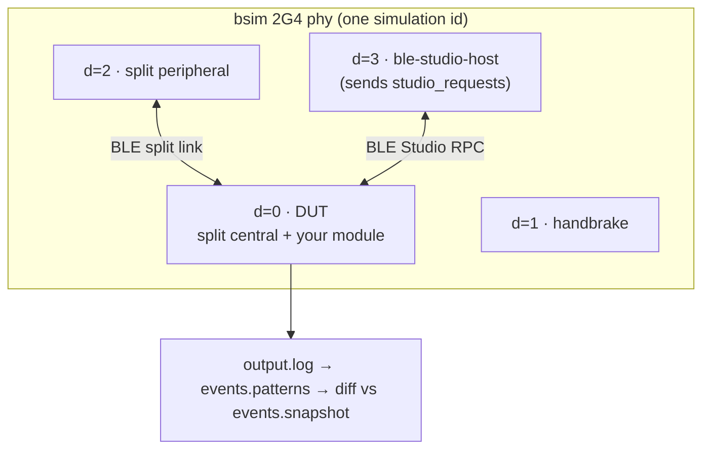

# `west zmk-ble-test` in depth

`west zmk-ble-test` runs a module's **BabbleSim (bsim) BLE tests** with no
hardware: it builds the DUT from the workspace ZMK app with your module added via
`ZMK_EXTRA_MODULES`, builds any split peripherals and host ("computer") apps,
launches them all under the bsim 2G4 phy, and diffs the filtered device output
against a checked-in snapshot. It is a Python port of the template repo's
`tests/ble/run-ble-test.sh`, kept byte-compatible with its `sort | sed | diff`
pass/fail pipeline.

For the quickstart and the `--help` summary see the
[README](../README.md#west-zmk-ble-test). This page covers the test-case layout,
the placeholder / device-numbering rules, BabbleSim setup, the ZMK revision
prerequisite, the Studio-over-BLE host app DSL, and the CI action.

All devices share one simulated 2G4 radio (the bsim phy). A typical split +
Studio case runs four devices — the DUT is always `d=0`, the handbrake `d=1`,
and every other device takes its id from its own `siblings.txt` line:



## Test case directory layout

A directory is a **test case** iff it contains `nrf52_bsim.keymap`; discovery
recurses from `tests_path` (default: current directory). Per-case files:

| File | Meaning |
|---|---|
| `nrf52_bsim.keymap` | marks the case; DUT keymap (needs a keys'd physical layout for Studio) |
| `nrf52_bsim.conf` | Kconfig shared by the DUT and peripherals (via `ZMK_CONFIG`) |
| `central.conf` | extra Kconfig applied to the DUT (central) only (via `EXTRA_CONF_FILE`) |
| `peripheral.conf` | extra Kconfig applied to peripheral builds only |
| `peripheral*.overlay` | one split-peripheral build each; presence ⇒ DUT built as a split central (`-DCONFIG_ZMK_SPLIT_ROLE_CENTRAL=y`) |
| `siblings.txt` | one command line per extra simulated device (`-d=2…`; `-d=0` is the DUT, `-d=1` the handbrake) |
| `studio_requests.json` | declarative `zmk.studio.Request` list (JSON DSL); if present, the shared `ble-studio-host` app is built for this case with these payloads embedded (see below) |
| `studio_requests.hex` | byte-exact escape hatch for the same (one framed request per hex line); mutually exclusive with the `.json` |
| `events.patterns` | `sed -E -n` script filtering the combined output log |
| `events.snapshot` | expected filtered output |
| `pending` | if present, a snapshot mismatch is PENDING instead of FAILED |

Builds land under `<west topdir>/build/ble/`; each case's `output.log`,
`filtered_output.log` and the aggregate `tests/pass-fail.log` are kept there.

## Placeholders in `siblings.txt`

`--sim-prefix NAME` (default: the sanitized module directory name) sets the bsim
simulation id (`<prefix>_<case>`) and the staged executable-name prefix. In
`siblings.txt`:

- `{prefix}` expands to the active prefix. Lines without placeholders run
  unchanged, so existing case data keeps working.
- `{studio_host}` expands to the case's staged shared-host executable name
  (`<sim id>_studio_host.exe` — only meaningful for cases with a
  `studio_requests.json`/`.hex`).

Custom module host apps (`tests/ble/*_host/`, the documented convention; the
legacy `tests/ble/*_central/` is still auto-discovered for backward compat)
are staged as both `<prefix>_<appname>.exe` and a plain `<appname>.exe`
alias.

## Device numbering & asserting any device (incl. peripherals)

The runner assigns `-d=0` to the DUT and `-d=1` to the bsim handbrake; **every
other device gets its id from its own `siblings.txt` line** (`-d=2`, `-d=3`, … as
written there — split peripherals are ordinary siblings: the runner stages
`<sim id>_<peripheral>.exe`, the case launches it). Each device prefixes its
stdout with `d_NN: @<sim time>`; the combined `output.log` captures the DUT
and all siblings (the handbrake is not captured). The evaluation pipeline's
stable `sort -t: -k1,1` groups lines per device (ascending id: the `d_00`
block, then `d_02`, `d_03`, …) while preserving each device's own
chronological order — so a snapshot lists one deterministic block per
asserted device, and **any device's lines can be asserted**, not just the
DUT/host. Relabel with a keyword-guarded substitution so only the intended
lines print (a substitution only prints when it matches, so the same keyword
appearing on another device's line is harmless), e.g. `split/basic`'s
peripheral rule:

```sed
/Welcome to ZMK!|security_changed: Security changed|kscan_process_msgq/s/^d_03: @[0-9]{2}:[0-9]{2}:[0-9]{2}\.[0-9]{6}  .{19}/peripheral /p
```

## Determinism guidance

bsim runs are deterministic per firmware build, but prefer lines that stay
stable across dependency bumps and avoid:
`*** Booting Zephyr OS build <hash> ***` (changes with every Zephyr/ZMK
revision), raw kscan-mock event encodings (`ev <number> …` — prefer the
decoded `…kscan_process_msgq: Row: …, pressed: …` lines), and HCI
version/build banner lines. Semantic lines (connection/security changes,
CCC subscriptions, position events) are stable and meaningful. When in
doubt, run the case at least twice (ideally with different `--sim-prefix`)
and confirm identical `filtered_output.log`.

## BabbleSim setup

bsim is Linux-only and comes from ZMK's manifest. Fetch and build it once, then
point the command at it:

```bash
$ west config manifest.group-filter -- +babblesim
$ west update --narrow
$ make -C "$(west topdir)/dependencies/tools/bsim" everything -j"$(nproc)"
$ export BSIM_OUT_PATH="$(west topdir)/dependencies/tools/bsim"
$ export BSIM_COMPONENTS_PATH="$BSIM_OUT_PATH/components"
```

`BSIM_OUT_PATH`/`BSIM_COMPONENTS_PATH` (or `--bsim PATH`) select the compiled
tree; the command errors with these instructions if it is missing or
uncompiled.

## ZMK revision prerequisite

The bsim BLE tests need two fixes not yet on `zmkfirmware/zmk` main — a writable
behavior local-id map section, and `settings_subsys_init` before dynamic BLE
handler registration (without them the split central segfaults or never starts
BLE on `nrf52_bsim`). Until they land upstream, pin
`cormoran/zmk@fffa339cf6f5c45366ab332d2b512f1c3c300753` in your test manifest
(this repo's `scripts/west-test-ble.yml` does exactly that, with a TODO to
unpin).

## Studio-over-BLE host app (no C, no Python in your module)

To exercise Studio RPC over BLE (including while the split link is active), your
case ships **one data file**: `studio_requests.json`, an ordered list of
`zmk.studio.Request` messages in protobuf's canonical JSON mapping. A bytes
field (e.g. a custom-subsystem `Call.payload`) may be written as
`{"$type": "<full.message.name>", ...fields}` — the infrastructure resolves
the name against the workspace's Studio protos plus your module's own
`proto/` directory, encodes the message and substitutes the bytes
(recursively); `request_id` is auto-assigned (1-based) when omitted:

```json
[
  { "custom": { "listCustomSubsystems": {} } },
  { "custom": { "call": {
      "subsystemIndex": 0,
      "payload": { "$type": "your_name.template.Request",
                   "sample": { "value": 42 } } } } }
]
```

The runner converts the JSON at test time (needs python `protobuf` + `protoc`
— see `requirements-test.txt`; the CI action installs both), automatically
builds this repo's shared [`ble-studio-host/`](../ble-studio-host/) app with the
payloads embedded, and stages it per case; reference it from `siblings.txt`
as `./{studio_host} -d=2`. See
[`ble-studio-host/README.md`](../ble-studio-host/README.md) for the full DSL
spec and [`tests/ble/studio/core/`](../tests/ble/studio/core/) for a complete
sample case. **Escape hatches:** a byte-exact `studio_requests.hex` (or the
programmatic API in `scripts/lib/ble/studio_requests.py`) for payloads the
JSON mapping cannot express, and a custom host app as
`tests/ble/<name>_host/` (legacy `tests/ble/<name>_central/` still
auto-discovered) for custom host-side logic. Prefer the shared app + JSON
whenever "send requests in order, snapshot the response hexdumps" is enough.

## GitHub Action

A thin composite action wraps the command for CI (enables the `+babblesim`
group, builds and caches the bsim tree, exports `BSIM_OUT_PATH` /
`BSIM_COMPONENTS_PATH`, and calls `west zmk-ble-test`). It assumes the caller
already ran checkout + `west init`/`west update` with `zmk-west-commands` in
the manifest, and runs in the `zmkfirmware/zmk-build-arm:4.1` container:

```yaml
- uses: cormoran/zmk-west-commands/.github/actions/zmk-ble-test@main
  with:
    tests: tests/ble
    module: .
```

See [`.github/actions/zmk-ble-test/README.md`](../.github/actions/zmk-ble-test/README.md)
for the full contract.
