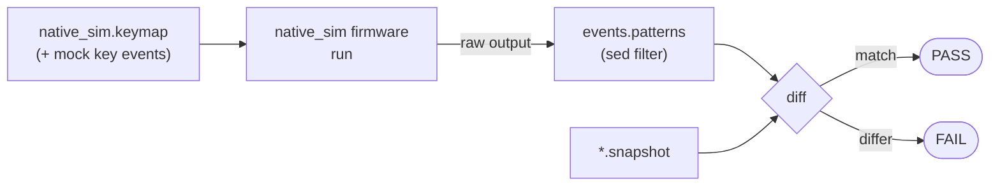

# `west zmk-test` in depth

`west zmk-test` wraps zmk's `run-test.sh` to set up the required environment
variables automatically. For the quickstart and the full `--help` output see the
[README](../README.md#west-zmk-test); this page describes how test cases are
laid out and discovered.

## Test case discovery

A directory is a **test case** iff it contains a `native_sim.keymap` file.
Discovery recurses from `test_path` (the current directory by default), so you
can point the command at a single case or at a parent directory holding many.

```bash
# Run one case
$ west zmk-test tests/test1

# Run every case found under a directory tree
$ west zmk-test tests
```

## Test case directory layout

Each case is a directory of files following ZMK's own native-posix
(`native_sim`) test convention. Using this repo's [`tests/test1`](../tests/test1)
as a worked example:

| File | Meaning |
|---|---|
| `native_sim.keymap` | **marks the case.** The DUT keymap; also drives the input by feeding mock key events to `&kscan` via `ZMK_MOCK_PRESS` / `ZMK_MOCK_RELEASE`. |
| `native_sim.conf` | Kconfig applied to this case's build (may be empty). |
| `events.patterns` | a `sed` script that filters the raw firmware output down to the lines you want to assert (e.g. `s/.*on_keymap_binding_//p`). |
| `*.snapshot` | the expected filtered output. The snapshot's base name is free-form (e.g. `keycode_events.snapshot`); the run compares the filtered log against it. |

At run time the firmware output is piped through `events.patterns` and diffed
against the snapshot: matching ⇒ PASS, differing ⇒ FAIL. This is the same
`sed | diff` model ZMK uses upstream, so existing ZMK-style cases work unchanged.



Example — [`tests/test1/native_sim.keymap`](../tests/test1/native_sim.keymap)
presses/releases position 0 twice, [`events.patterns`](../tests/test1/events.patterns)
strips everything up to the `on_keymap_binding_` prefix, and
[`keycode_events.snapshot`](../tests/test1/keycode_events.snapshot) asserts the
resulting `pressed:` / `released:` lines.

## Testing your own module

Pass your module (or zmk-config) repository root with `-m` so its code is
included during the test build:

```bash
$ west zmk-test <path to zmk test directory> -m <path to your zmk module or zmk-config>
```
